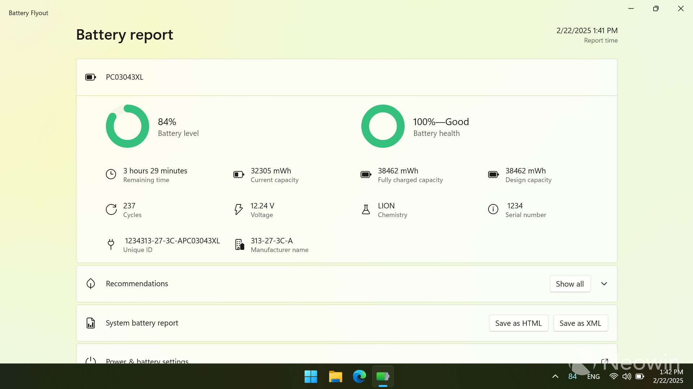
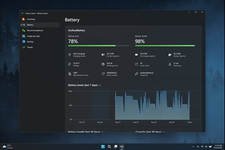
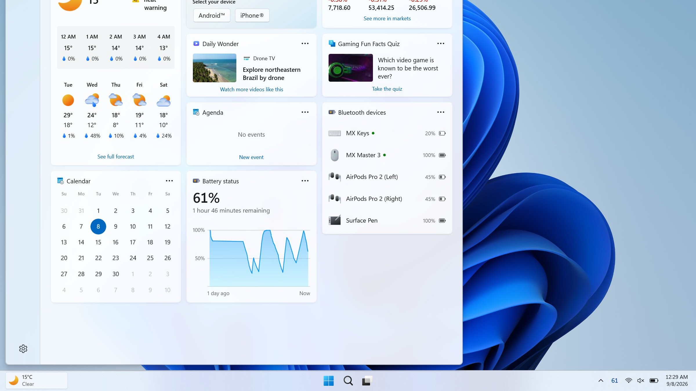

# Battery Flyout

Battery Flyout is a small tray tool for Battery Flyout Windows 11. The stock icon hides the number. Battery Flyout taskbar percentage puts the percent on the icon and colors it for charging, low charge, and Energy Saver.

A click opens the Windows 11 battery flyout: level, charging state, a short history, and a power mode switch. Bluetooth headsets, mice, and keyboards that report a level show up in the same panel.

Battery Flyout Windows is a one-time purchase in the store listing. No ads, no account, no activity log.

Tray host is [halo_battery.pyw](halo_battery.pyw). Flyout panel is [flyout.py](flyout.py). Icon paint is [icons.py](icons.py).

## The icon

The icon sits in the notification area. The number is the laptop percent. Green means charging and healthy. Yellow means low or Energy Saver. Red means plug in now.

Hover shows the same percent if the icon is too small to read. Left click opens the flyout. Right click is the short menu.

App start is [App.xaml.cs](App.xaml.cs). Main window is [MainWindow.xaml.cs](MainWindow.xaml.cs). Status view is [Status.xaml.cs](Status.xaml.cs).

If the icon hides in the overflow, drag it back to the tray. The flyout still works from the overflow chevron.

## Tray menu

The menu is small on purpose. Open the flyout, switch power mode, open Windows battery settings, quit.

Power mode is Best power efficiency, Balanced, or Best performance. Battery Flyout power mode switcher writes the Windows plan. It does not invent a fourth plan.

Brightness slider, when the build shows one, is a five-step strip. It is not a second flyout.

Brightness helper is [Brightness.cs](Brightness.cs). About page is [About.xaml.cs](ui/About.xaml.cs). Settings store is Settings.Designer.cs under settings/.

Do not paste a machine-local loop address into a note. This tool has no server field.

## Features

- Battery Flyout taskbar percentage on the icon
- Color for charge, low battery, and Energy Saver
- Compact Windows 11 battery flyout
- Battery history
- Battery Flyout power mode switcher
- Battery Flyout Bluetooth battery levels
- Battery Flyout charging notification
- Battery Flyout low battery alert
- No account and no ad row

| Row | What you see |
| --- | --- |
| Laptop percent | Number on the icon |
| Charging | Green while the cord is in |
| Low | Yellow, then a toast |
| Full | Toast when the pack hits full |
| Bluetooth | Level next to the device name |

| Piece | Role |
| --- | --- |
| Battery Flyout | Tray icon and panel |
| Battery Flyout Windows | The same tool on Windows |
| Battery Flyout Windows 11 | The OS it targets |
| Store build | One-time purchase, no ads |

History log is [history.py](history.py). Device base is [base.py](device/base.py). Power read is [xinput.py](power/xinput.py).

A desktop with no battery still runs, but the laptop percent stays empty. The Bluetooth rows can still show.

## Screenshots

People post the percent icon and the open panel. The live product is that icon after you unplug. The color should change without a reboot.

Window markup is MainWindow.xaml at pack root. Status markup is Status.xaml. App markup is App.xaml.

## Requirements

Battery Flyout Windows 11 is the target. A Windows 10 laptop may show a tray icon, but the flyout layout in this handbook is the 11 panel.

The PC needs a battery for the percent. Bluetooth levels need the device to report them. A dongle that hides the battery will not invent a number.

.NET desktop bits ship with Windows for the window host. The Python samples in this pack are not the store installer.

The project file and the solution file sit at pack root next to App.config. Requirements list is requirements.txt.

Those files do not install Battery Flyout.

## Get Battery Flyout

Use the GET badge. The Microsoft Store page is the vendor build. One purchase, no account inside the app.

Skip random tray clones. The store hash is the one that matches this handbook.

### Portable mode

A portable folder can sit next to the exe and keep settings there. The store build uses the user profile. Do not run both on one PC. Two icons fight for the same click.

### First hour

Pin the icon. Unplug. Confirm the percent. Open the flyout. Switch power mode once, then put it back. Connect a headset that reports battery and check the row.

## Supported devices

The laptop battery is the main row. Bluetooth devices that Windows already knows can add a level: headphones, a mouse, a keyboard, a controller.

Bluetooth reader is [bluetooth.py](bluetooth/bluetooth.py). Device list is hidlist.py under device/.

A device with no battery report stays off the list. That is the hardware, not a missing purchase.

Brand-specific readers in this pack are samples under device/. They do not replace the store flyout.

## Add your device

Pair it in Windows Bluetooth settings first. If Windows itself shows a percent, Battery Flyout can show it too. If Windows shows nothing, the flyout cannot guess.

Poll sample is test_bluetooth_poll.py under tests/. Tray icon sample is test_tray_icons.py under tests/.

Rename a row in the menu if two devices look the same. Hide a row you do not want in the panel.

## Notifications

Battery Flyout charging notification fires when the pack reaches full, so you can unplug. Battery Flyout low battery alert fires at the threshold you set. One toast per crossing, not a loop.

Event helper is [winevents.py](notify/winevents.py). Notice sample is [updates.py](notify/updates.py). Notification test is [test_notifications.py](tests/test_notifications.py).

Focus assist can hide the toast. The icon color still changes. Check the flyout if you missed the banner.

## Troubleshooting

If the percent is blank, the PC has no battery or the icon is the stock Windows one. Battery Flyout is a second icon until you hide the stock one in taskbar settings.

If the color stays gray, the flyout has not read a sample yet. Wait one refresh. Unplug and plug once.

If a Bluetooth row is stuck, disconnect and reconnect the device. A stale percent is worse than a gap.

Flyout test is [test_flyout.py](tests/test_flyout.py). Second power path is wgi.py under power/.

A feature update can move tray icons into the overflow. Drag Battery Flyout back.

## Disclaimer

Power mode changes are real Windows power plans. Best performance on battery will drain faster. Put Balanced back when you leave the desk.

This handbook is not a Microsoft power driver. Battery Flyout reads the level Windows already exposes.

Assembly info is AssemblyInfo.cs under settings/. Resource map is Resources.Designer.cs under settings/.

## Privacy

No account. No ad network. No activity log of which apps you open. The history is battery samples on the PC.

Do not screenshot a device name you would not say out loud. The Bluetooth row uses the name Windows stored.

## Related Questions

**How do I display the battery percentage in the Windows 11 taskbar?**

Install Battery Flyout and pin the icon. Battery Flyout taskbar percentage is the number on that icon. Windows 11 also has a stock toggle under System, Power and battery, on newer builds. The flyout is the panel you get when the stock icon is not enough.

**How to check which app is draining battery in laptop?**

Open Windows Settings, System, Power and battery, Battery usage. That list is per app. Battery Flyout shows the pack level, charge state, and history. It is not a second copy of the per-app usage page.

**How to show battery percentage of bluetooth device?**

Pair the device so Windows can see a level. Open the Windows 11 battery flyout. Battery Flyout Bluetooth battery levels lists the devices that report a percent. A receiver dongle that hides the battery will stay blank.

**How do I update my battery driver in Windows 11?**

That is Device Manager, Batteries, the Microsoft ACPI battery node, Update driver. Battery Flyout does not ship a battery driver. Update Windows first. Then reopen the flyout and check the percent.

## License

The store build of Battery Flyout uses the vendor terms. One LICENSE file covers pack samples. Do not add a second LICENSE beside README.

Build script is build_exe.bat under scripts/. Init file is __init__.py under device/. Brand readers under device/ are pack samples.

A full charge toast and a low toast use different thresholds. Set full at the top and low where you still have time to find a cable. Twenty percent is a common low mark. Ten is late.

Energy Saver in Windows can turn on by itself near that low mark. The icon goes yellow. Battery Flyout does not fight that mode. It only shows it.

History is a short trail of samples, not a year of logs. Use it to see if the pack fell fast after a game, then open Windows Battery usage for the app list.

A docked laptop on a desk may sit at 80 percent if you set a charge limit in the OEM app. The flyout will show 80 and charging. That limit is the OEM, not a stuck icon.

Sleep keeps the last sample. After wake, wait one refresh before you call the percent stale.

A second monitor does not add a second battery. The tray icon is one.

Bluetooth levels refresh slower than the laptop percent. A headset can sit on the last number for a minute. That is the radio, not a frozen flyout.

If two headsets are connected, both rows should show. Hide the one you are not using.

Controllers on a cable may report through a different path than Bluetooth. If the row is missing, the cable path did not expose a percent.

Best performance while plugged in is fine. Best performance on a train is how you miss the low toast. Switch back before you close the lid.

The flyout closes when you click away. The icon stays. Quitting from the menu is the only full exit.

Startup with Windows is a checkbox if the store build offers it. A second shortcut in the Startup folder will launch two copies. Use one.

High contrast does not restyle the percent digits. The colors are the product. If yellow is hard to see, read the number.

A tablet with a detachable keyboard still has one pack. The flyout follows that pack.

Remote desktop may not show the remote battery in the local tray. Run Battery Flyout on the laptop itself.

Safe mode will not load a store tray app. Check the percent in a normal session.

If Windows Update replaces the stock icon, your Battery Flyout icon should remain. Pin it again if it drops into the overflow.

Do not disable the Microsoft ACPI battery driver to "fix" the flyout. The flyout reads that driver. Update it, do not remove it.

A report that the percent jumps from 40 to 70 is the pack, not the icon. Calibration is a Windows battery report, not a flyout setting.

Charging overnight is what the full toast is for. If you silence notifications, look at the icon in the morning.

Low battery alert should fire once. If it loops, the threshold is flapping around the same percent. Raise it or lower it by five points and test again.

The power mode switcher does not change the screen timeout. That stays in Windows Power settings.

Bluetooth battery levels do not change the laptop power plan. They are a list, not a switch.

Windows 11 battery flyout and the stock Quick Settings panel can both be open. They should agree on the laptop percent. If they do not, refresh both.

A one-time purchase does not add a subscription row. If a site asks for a monthly fee, it is not this store build.

Pack samples under tests/ check the panel, the tray, and the toast. They do not install Battery Flyout.

A percent that reads 100 while the cord is in is full. Unplug and the number should fall. If it stays at 100 for an hour of use, the pack is not reporting drain. That is a battery report issue in Windows, then a flyout issue.

Color and number should match. Green at 15 percent is wrong. Yellow or red at 15 is right. Reopen the flyout once if they disagree.

The store build does not ask for a Microsoft account inside the panel. Sign-in, if Windows asks, is the store purchase, not a Battery Flyout login.

Keep one icon. A leftover from an old zip plus the store icon is two percents. Quit the extra.

Night mode in Windows does not dim the tray number. If you cannot read it, increase the tray scale in Windows display settings, not inside the flyout.

A closed lid on a dock still charges. Open the flyout on the external screen after you wake the PC. The percent should match the lock screen icon.

If the GET badge is the path you use, skip a third-party mirror. The store build and the one-time purchase stay on that channel.

A restart of Explorer can hide the icon for a moment. It should return. Start Battery Flyout from the Start menu if it does not.

## Related Search Terms

Battery Flyout, Battery Flyout Windows, Battery Flyout Windows 11, Battery Flyout taskbar percentage, Windows 11 battery flyout, windows, windows-11, battery, taskbar, system-tray, bluetooth, power, notifications, laptop, flyout, energy, diagnostics
